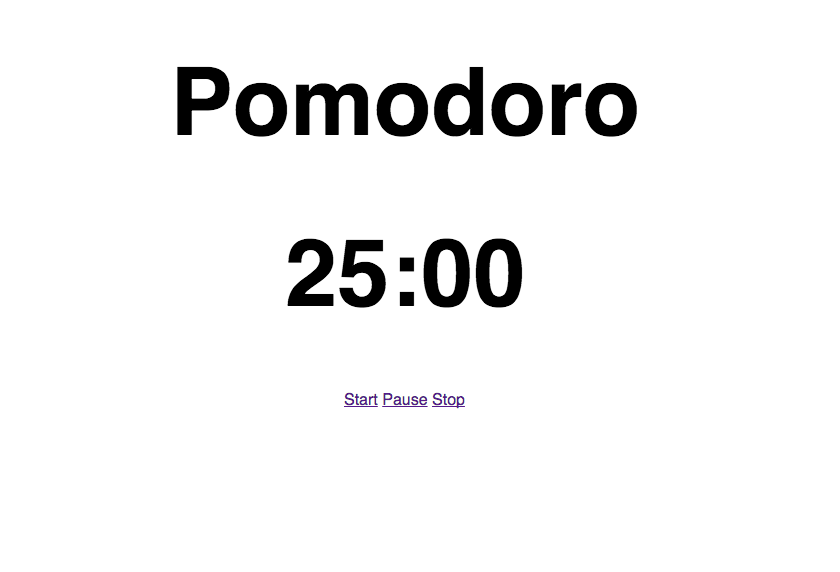

# Pomodoro
Simple pomodoro app. It's essentially just a countdown timer from 25:00 to 0:00 with pause and stop.

## Install
There are two dependencies.

* Ruby
* Sinatra

With those two dependencies met, clone the repository and run `ruby app.rb` from the root directory.

